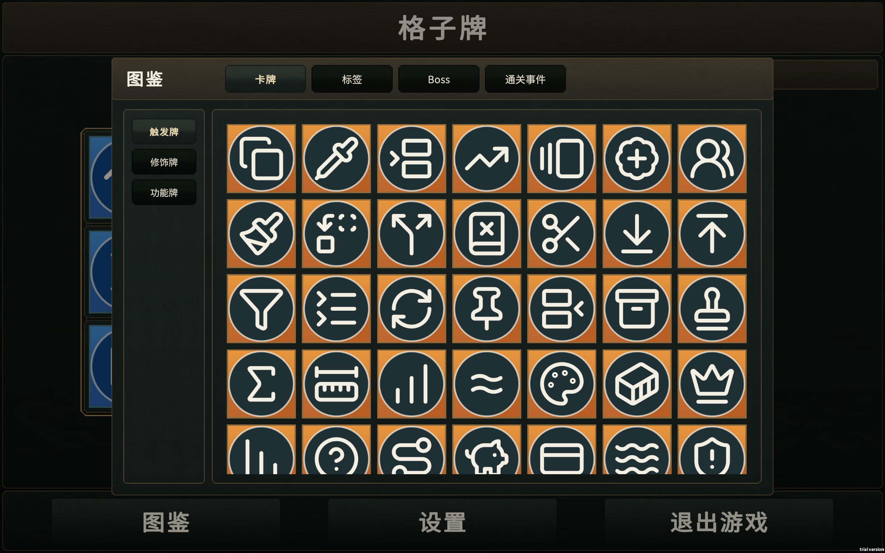
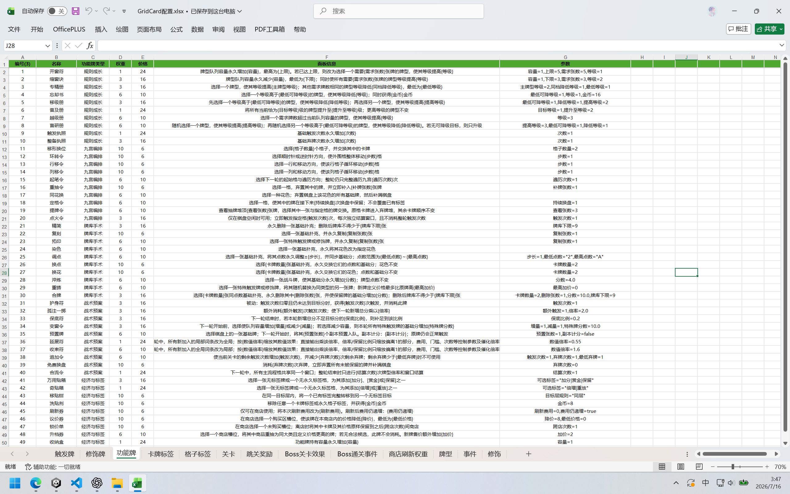
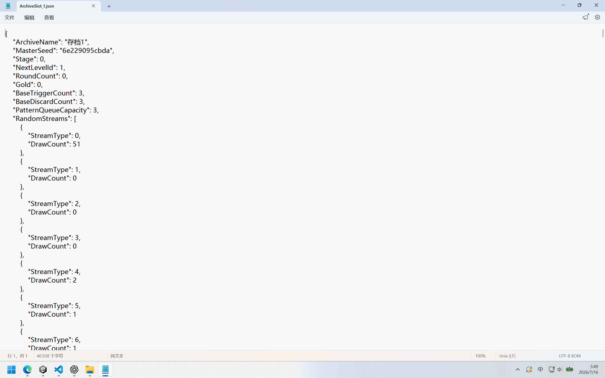

# Grid Card

> 在九宫格中编排卡牌、触发连锁，并用扑克牌型构筑得分。

[▶ 播放局内宣传视频（MP4）](Media/gameplay.mp4)

## 下载试玩

[**下载 Windows 试玩版**](https://github.com/L47-Coder/Grid-Card-Showcase/raw/refs/heads/main/Grid-Card-Windows.zip)

下载并解压后，运行 `Grid Card/Grid Card.exe`。

> [!IMPORTANT]
> 当前版本暂时仅适配 **16:10** 屏幕比例，推荐使用 **1920 × 1200** 分辨率运行。

## 游戏玩法

棋盘由 3 × 3 九宫格组成，卡牌默认按外围顺时针、最后中宫的顺序结算：

```text
1   2   3
8   9   4
7   6   5
```

1. 拖拽交换九宫格中的卡牌，规划触发顺序。
2. 触发牌提供分数并进入牌型队列；对子、顺子、同花等牌型会放大当前窗口分。
3. 修饰牌可以添加词条或递归触发其他格子，形成跨格连锁。
4. 每关初始拥有 3 次触发与 3 次弃牌，在触发次数耗尽前达到目标分即可通关。

普通关通关后进入商店，每 3 关出现一次 Boss。完整流程共 24 关，包含 **102 张触发牌、50 张修饰牌、50 张功能牌与 15 种牌型**。



## 技术实现

### 数据配置链路

```text
XLSX（权威数据源）→ CSV（导入快照）→ ScriptableObject（运行时资源）
```

配置人员只需要维护 XLSX。自动化工具负责导出 CSV，并将数据导入 Unity 生成对应的 ScriptableObject：XLSX 是唯一的人工维护入口，CSV 和 SO 均为生成产物，无需手动修改。



### 存档

游戏状态通过 JSON 持久化，并采用阶段存档：在进关、离店和关卡结算等稳定边界统一写盘。这样既能避免保存到流程中间态，也为玩家提供了清晰的 S/L（Save/Load）节点。

### 随机流

随机系统由一个 `MasterSeed` 派生出多条独立随机流。抽牌、商店、Boss、事件和奖励分别使用稳定的 Stream Key，并在每次消费后记录进度；某个系统增加随机调用时，不会改变其他系统的结果，也能在读档后稳定复现。



### 触发系统

项目包含大量卡牌效果。为了避免为每张卡牌创建一个独立类型，触发系统采用 **ID → Handler** 的注册方式：

```text
启动时反射扫描处理函数
  → 建立 ID 与 Handler 的映射
  → 触发器读取卡牌 ID
  → 构造本次执行上下文
  → 查找并执行对应 Handler
```

`TriggerManager` 负责九宫格遍历、词条顺序、递归触发、标签、牌型与 Boss 规则的统一编排；Handler 只实现具体卡牌效果。卡牌数值来自配置，执行逻辑来自代码，两者互不混杂。

触发开始前会快照存档、关卡会话、棋盘、牌堆与随机进度；流程完整成功后才提交，发生异常或取消时整体回滚。

### 工程技术

| 技术 | 用途 |
| --- | --- |
| Assembly Definition | 拆分 `Core`、`ScriptableObject`、`Component`、`Manager` 与 `App`，明确程序集职责和依赖方向 |
| VContainer + Stratum | 通过依赖注入装配运行时服务，调用方只依赖所需的窄接口 |
| Addressables | 统一配置、Prefab 与面板的资源定位、异步加载和句柄缓存 |
| UniTask | 串联启动、资源、UI、牌堆与触发流程，管理取消和异步生命周期 |

`Unity 2022.3.60f1c1` · `C#` · `URP 14` · `VContainer 1.17.0` · `Addressables 1.22.3` · `UniTask 2.5.10`

## 仓库说明

本仓库只包含可运行的游戏构建版本和项目介绍，不包含 Unity 工程及源代码。

**Grid Card 游戏本体并非开源软件。** 未经许可，不得复制、修改、反编译、再分发或用于商业用途。
